**Baixe o projeto e siga as instruções:**

Primeiro na sua classe `MainActivity`, adicione seu **nome completo** no local indicado.

  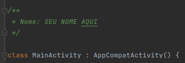

  

Começando com o fragmento principal do aplicativo onde as transações financeiras serão listadas.

  

Crie sua classe *Kotlin* no diretório onde já está sua `MainActivity`, para isso clique com o botão direito no diretório *New -> Kotlin class/file* e dê o nome `FragmentoTransacoes` à sua classe criada.

  

Agora crie o layout que será associado ao fragmento, dentro do diretório *res/layout* clique com o botão direito do mouse em *New -> Layout Resource File* e nomeie-o como **fragmento_transacoes**.

Preste atenção aos nomes que você digita, pois os arquivos de layout devem conter apenas letras minúsculas e não devem ter caracteres especiais ou começar com números.

Por fim, vamos indicar que a classe `FragmentoTransacoes` é do tipo fragmento. Para isso vamos estender a classe `FragmentoTransacoes` do tipo `Fragment` e passar nosso layout criado anteriormente no construtor da classe `Fragment`. Conforme a imagem.

  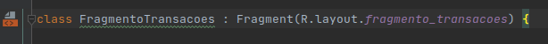

  

O layout do **fragmento_transacoes** deve conter:

  

Um `TextView`, com id **textViewCarteira**, onde indica o saldo na carteira do usuário.

Um `Button`, com id **buttonAdicionar**, onde o usuário pode adicionar valores à sua carteira.

Um `Button`, com id **buttonRetirar**, onde o usuário pode sacar valores de sua carteira.

Um `RecyclerView`, com id **recyclerviewTransacoes**, onde listará as transações realizadas pelo usuário.

  

Veja o layout abaixo.

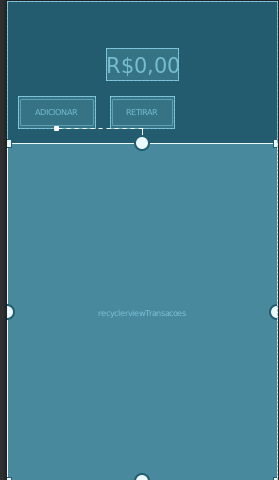

  

Além disso, seu *recyclerview* precisará de um layout para cada item em seu *recyclerview*. Para isso, crie um outro arquivo de layout chamado **item_transacao** que deve conter:

  

Um `ImageView`, com id **imageview**, que deve exibir um ícone indicando se é uma retirada ou entrada de valores a carteira do usuário.

Um `TextView`, com id **textViewValor**, que deve exibir o valor da transação do usuário.

Um `TextView`, com id **textViewCategoria**, que deve indicar a categoria da transação do usuário.

  

Veja o layout abaixo.

  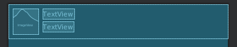

  

Feito isso, vamos criar uma classe auxiliar chamada `Transacao`, fazendo da mesma forma que criamos nossa classe `FragmentoTransacoes`" Essa classe será nosso modelo de transação do usuário, contendo o valor da transação, categoria e se é uma retirada ou adição de valores.

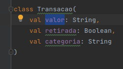

  

Também criaremos nosso *adapter* de transações para o *recyclerview*, `AdapterTransacoes`, onde ele deverá receber uma lista de transações. E também nosso `ViewHolder`, `TransacaoViewHolder`, que representará o layout dos nossos itens do *RecyclerView*.

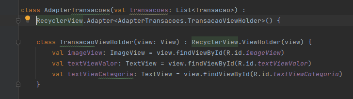

  
  

O `getItemCount` do nosso *adapter* deve retornar o número de itens em nossa lista de transações.

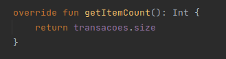

O `onCreateViewHolder` deve carregar o layout do item da transação e retornar o `TransactionViewHolder`.

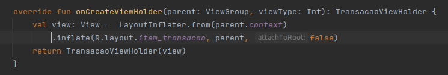

  

Por fim, o método `onBindViewHolder` indicará nosso item de acordo com os valores de nossa lista, também faremos uma lógica para qual tipo de imagem será exibida em nosso item de lista, indicando se é uma entrada ou retirada.

  
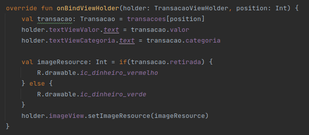

Com seu *adapter* pronto, basta popular o *adapter* e vinculá-lo ao layout do fragmento. Lá em `FragmentoTransacoes` dentro do método `onViewCreated`, o método indicado para manipular layouts, vamos pegar a referência do nosso *recyclerView* e também já inicializar nosso adaptador. Observe que usamos um método da nossa atividade para retornar a lista de transações, você não precisa se preocupar muito com isso agora, mas recomendo fortemente estudar mais sobre essa implementação.

Também exibiremos o saldo da carteira do usuário.

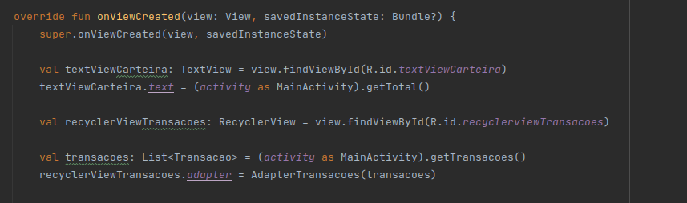

Agora vamos para o segundo fragmento do nosso projeto, onde começaremos a criar uma transação. Este fragmento será chamado quando o usuário clicar no botão "adicionar" ou "remover" na tela do `FragmentoTransacoes`.

  

A classe do fragmento e seu layout serão nomeados como `FragmentoValorTransacao` e **fragmento_valor_transacao** respectivamente.

  

O layout do nosso **fragmento_valor_transacao**, deve conter:

  

Um `EditText`, com id **editTextValor**, onde o usuário ira digitar o valor da transação. Verifique se você removeu o atributo text ou deixou vazio, e também se adicionou o atributo *hint* com valor "Digite o valor", também utilize o atributo **android:inputType="number",** dessa forma abrira apenas o teclado numérico no dispositivo do usuário.
  

Um `Button`, com o id do **buttonContinuar**, onde o usuário irá para a tela da categoria da transação.

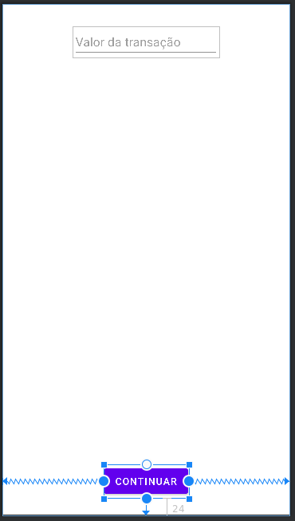

  

Agora a terceira tela do projeto deve conter uma lista de categorias de transações. Elas devem ser exibidas em um *recyclerview* e ao clicar em uma das categorias, nós então iremos para a ultima tela do app.

  

A terceira tela terá a classe e layout nomeados como `FragmentoCategoriaTransacao` e **fragmento_categoria_transacao**.

  

O layout **fragmento_categoria_transacao** deve conter:

  

Um `RecyclerView`, com id **recyclerViewCategorias**, onde ira exibir as categorias das transações.

  

O layout do item da nossa lista de categorias deve ser chamado **item_categoria**, e deve conter:

  

Um `TextView`, com id **textViewCategoria**, onde será exibido o nome da categoria.

  

Também será criado um *adapter* para o nosso *RecyclerView* de categorias. Ele será chamado `AdapterCategorias` e deve receber dois parâmetros em seu construtor, uma lista de strings que será como categorias e um *callback* para quando o usuário clicar em uma das categorias.

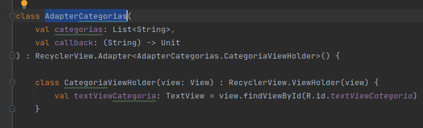

  

O método `onBindViewHolder` do nosso *adapter*, além de definir o texto da categoria, invocará nosso *callback* ao clicar no item.

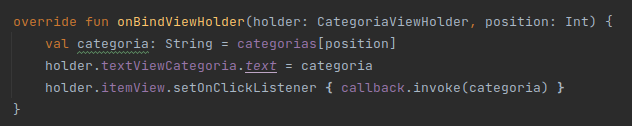

Vamos aplicar o *adapter* para o layout do nosso fragmento e preenchê-lo com os itens. Dentro do `onViewCreated` do `FragmentoCategoriaTransacao`, vamos pegar a referência do nosso *recyclerview*, e inicializar nosso adaptador. Veja que estamos deixando um bloco vazio, que será nosso *callback*, mas não se preocupará depois de preenchê-lo.

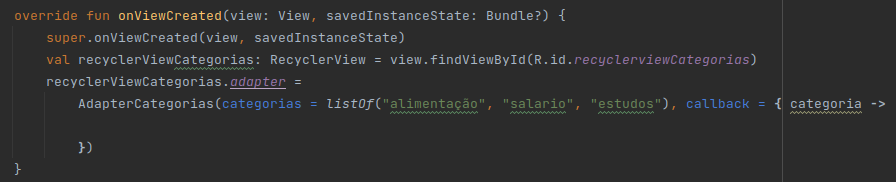

  

A última de nossas telas será um `FragmentoConfirmaTransacao` com layout **fragmento_confirma_transacao**. Neste fragmento mostraremos ao usuário os parâmetros que foram passados entre as telas. Não se preocupe com esses parâmetros ainda, este é o nosso último passo.

O layout do **fragment_confirma_transacao** deve conter:

  

Um `TextView`, com id **textViewValor**, que exibirá o valor da operação.

Um `TextView`, com id **textViewCategoria**, que exibe uma categoria de nossa operação.

Um `TextView`, com id **textViewTipo**, que irá exibir nossa operação é do tipo adição ou retirada.

Um `Button`, com id **buttonSalvar**, que salvará nossa operação.

  

O layout está livre desde que tenham todos os elementos indicados. Veja o código do método `onViewCreated` da classe `FragmentoConfirmaTransacao`.

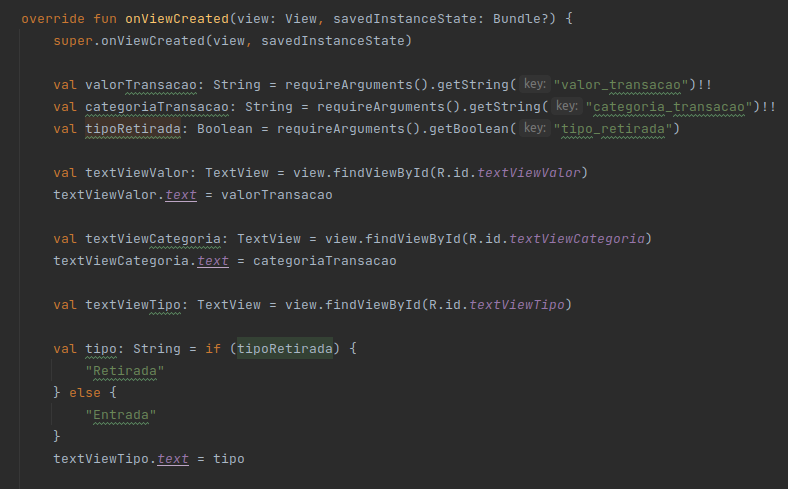

  

Agora vamos criar nosso fluxo e fazer a passagem de parâmetros. Para isso, nas pastas do projeto, clique com o botão direito do mouse em `res` e clique em *New-> Android Resource File*, nomeie o arquivo **nav_fluxo_app**, e coloque o Resource Type como navigation.

  
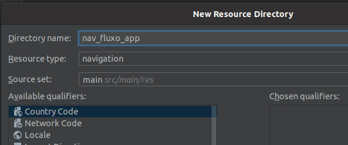

Abra o arquivo **nav_fluxo_app** e com o modo "design" ativado clique no botão adicionar fragmentos, e adicione nossos fragmentos criados, e também vincule-os clicando em um fragmento e arrastando para outro.

  

É importante que na última navegação você adicione o comportamento *popupTo* para a primeira tela, assim quando executarmos o aplicativo e chegarmos ao final do fluxo, se pressionarmos de volta na última tela, votaremos no início do fluxo.

  
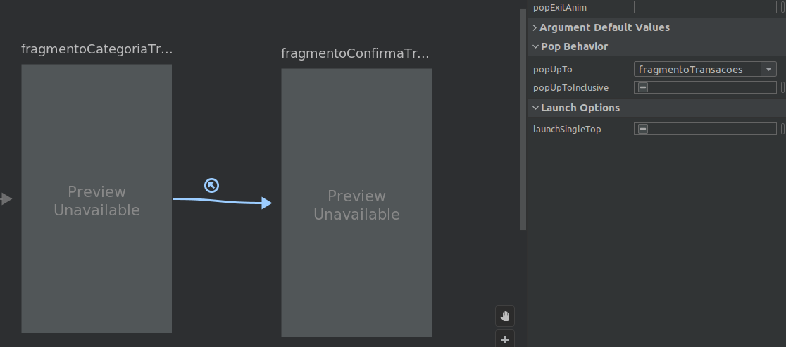

Com o nosso grafo de navegação configurado, iremos configurar ele no layout da nossa `MainActivity`. Para isso adicione ao layout **main_activity** o componente `FragmentContainerView` e adicione os atributos **id, name, defaultNavHost e navGraph**, conforme a imagem abaixo.

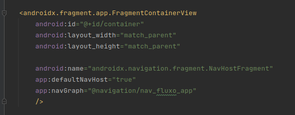

Estamos quase lá.

  

Vamos passar ligar as telas e fazer a passagem de parâmetros. No `FragmentoTransacoes`, também dentro do método `onViewCreated` vamos adicionar um evento de clique nos botões adicionar e retirar, fazendo a navegação para a tela `FragmentoValorTransacao`, passando o parâmetro que indica se a transação é do tipo retirada ou não. Vamos criar um `Bundle` aonde iremos passar os parâmetros, e vamos usar o `findNavController` e o `navigate` passando o id da nossa navegação. Perceba que o parâmetro "tipo_retirada" é falso para o evento de clique do botão adicionar e verdadeiro para o evento de clique do botão tirar.

  
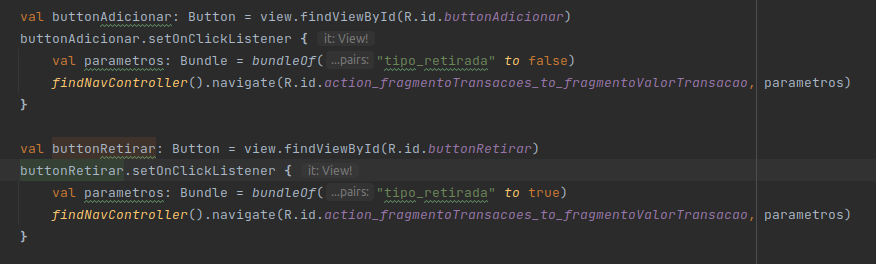

No fragmento `FragmentoValorTransacao`, no método `onViewCreated` iremos recuperar o parâmetro passado pela tela anterior e adicionar um evento de clique ao botão continuar. Veja que agora iremos navegar para a tela de categoria, passando o parâmetro recuperado na ultima tela e também o valor digitado no `EditText` de valor da transação.

  
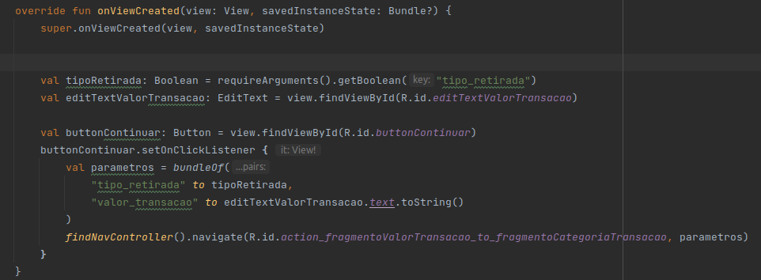

No `FragmentoCategoriaTransacao` agora vamos completar aquele método de *callback* que estava vazio, recuperando os parâmetros das telas anteriores e passando o novo parâmetro de categoria selecionada, por fim navegando para a tela final do fluxo.

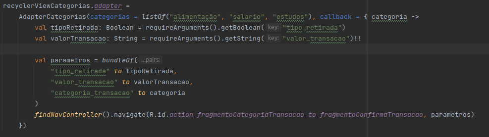

Agora na nossa ultima tela `FragmentoConfirmaTransacao` faltou o método de confirmar transação. Para isso vamos adicionar também no onViewCreated um evento ao botão salvar aonde ao clicar iremos chamar o método de salvar a transação então fazer a navegação voltar para o inicio.

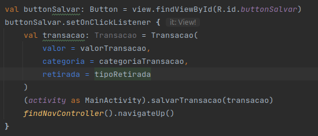
